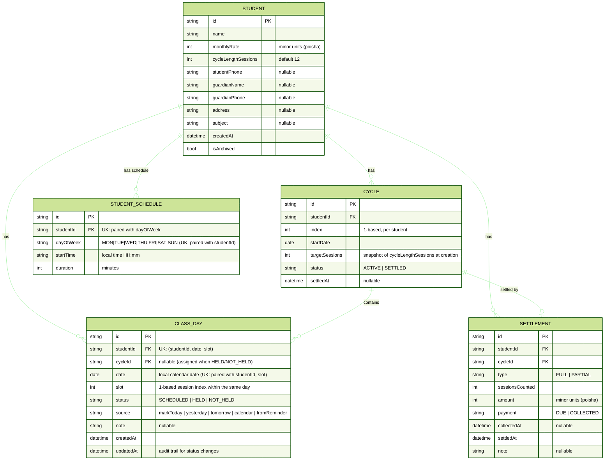

```mermaid
---
config:
  theme: forest
  look: classic
  themeVariables:
    lineColor: "#90EE90"
---
erDiagram
	STUDENT {
		string id PK ""  
		string name  ""  
		int monthlyRate  "minor units (poisha)"  
		int cycleLengthSessions  "default 12"  
		string studentPhone  "nullable"
		string guardianName  "nullable"
		string guardianPhone  "nullable" 
		string address  "nullable"
		string subject  "nullable" 
		datetime createdAt  ""  
		bool isArchived  ""  
	}

	CYCLE {
		string id PK ""  
		string studentId FK ""  
		int index  "1-based, per student"  
		date startDate  ""  
		int targetSessions  "snapshot of cycleLengthSessions at creation"  
		string status  "ACTIVE | SETTLED"  
		datetime settledAt  "nullable"  
	}

	CLASS_DAY {
		string id PK ""
		string studentId FK "UK: (studentId, date, slot)"
		string cycleId FK "nullable (assigned when HELD/NOT_HELD)"
		date date  "local calendar date (UK: paired with studentId, slot)"
		int slot  "1-based session index within the same day"
		string status  "SCHEDULED | HELD | NOT_HELD"
		string source  "markToday | yesterday | tomorrow | calendar | fromReminder"
		string note  "nullable"
		datetime createdAt  ""
		datetime updatedAt  "audit trail for status changes"
	}

	STUDENT_SCHEDULE {
		string id PK ""
		string studentId FK "UK: paired with dayOfWeek"
		string dayOfWeek  "MON|TUE|WED|THU|FRI|SAT|SUN (UK: paired with studentId)"
		string startTime  "local time HH:mm"
		int duration  "minutes"
	}

	SETTLEMENT {
		string id PK ""  
		string studentId FK ""  
		string cycleId FK ""  
		string type  "FULL | PARTIAL"  
		int sessionsCounted  ""  
		int amount  "minor units (poisha)"  
		string payment  "DUE | COLLECTED"  
		datetime collectedAt  "nullable"  
		datetime settledAt  ""  
		string note  "nullable"  
	}

	STUDENT ||--o{ CYCLE : "has"
	STUDENT ||--o{ CLASS_DAY : "has"
	STUDENT ||--o{ SETTLEMENT : "has"
	STUDENT ||--o{ STUDENT_SCHEDULE : "has schedule"
	CYCLE ||--o{ CLASS_DAY : "contains"
	CYCLE ||--o| SETTLEMENT : "settled by"
```