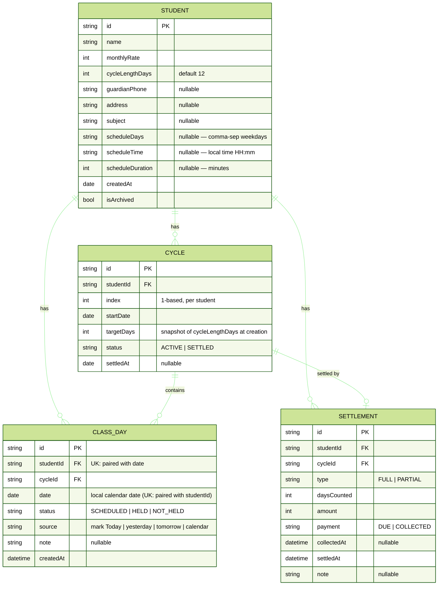

```mermaid
---
config:
  theme: forest
  look: classic
  themeVariables:
    lineColor: "#90EE90"
---
erDiagram
	STUDENT {
		string id PK ""  
		string name  ""  
		int monthlyRate  ""  
		int cycleLengthDays  "default 12"  
		string guardianPhone  "nullable" 
		string address  "nullable"
		string subject  "nullable" 
		string scheduleDays  "nullable — comma-sep weekdays"  
		string scheduleTime  "nullable — local time HH:mm"  
		int scheduleDuration  "nullable — minutes"  
		date createdAt  ""  
		bool isArchived  ""  
	}

	CYCLE {
		string id PK ""  
		string studentId FK ""  
		int index  "1-based, per student"  
		date startDate  ""  
		int targetDays  "snapshot of cycleLengthDays at creation"  
		string status  "ACTIVE | SETTLED"  
		date settledAt  "nullable"  
	}

	CLASS_DAY {
		string id PK ""
		string studentId FK "UK: paired with date"
		string cycleId FK ""
		date date  "local calendar date (UK: paired with studentId)"
		string status  "SCHEDULED | HELD | NOT_HELD"
		string source  "mark Today | yesterday | tomorrow | calendar"
		string note  "nullable"
		datetime createdAt  ""
	}

	SETTLEMENT {
		string id PK ""  
		string studentId FK ""  
		string cycleId FK ""  
		string type  "FULL | PARTIAL"  
		int daysCounted  ""  
		int amount  ""  
		string payment  "DUE | COLLECTED"  
		datetime collectedAt  "nullable"  
		datetime settledAt  ""  
		string note  "nullable"  
	}

	STUDENT||--o{CYCLE:"has"
	STUDENT||--o{CLASS_DAY:"has"
	STUDENT||--o{SETTLEMENT:"has"
	CYCLE||--o{CLASS_DAY:"contains"
	CYCLE||--o|SETTLEMENT:"settled by"
```