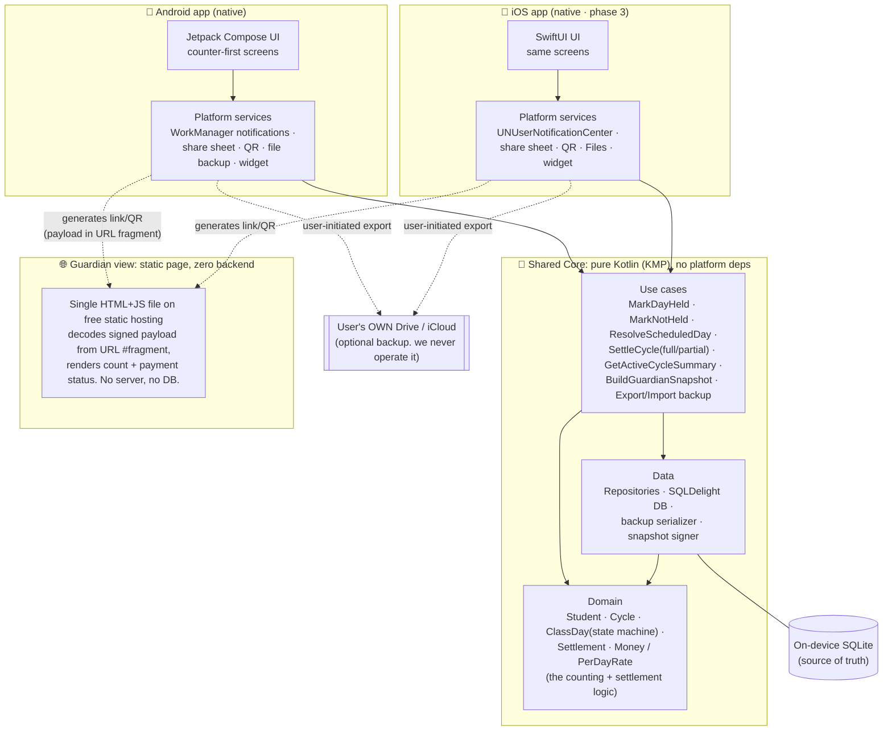
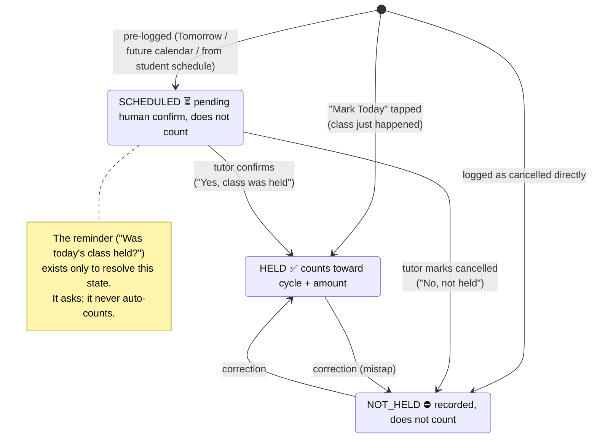

# Tuition Lord System Design

## 0. The one thing to get right

Tuition Lord's entire competitive reason to exist is that it is **local-first, offline, no-account, no-server**. The existing similar app ("Tuition Tracker") loses old months' data, forces a Gmail login, and can't tell a cancelled class from a held one. We win by being *more reliable with less infrastructure*, not more.

So the design has three load-bearing ideas:

1. **The phone is the source of truth.** There is no product backend. Correctness and durability of the *local* data model is the moat.
2. **All the real complexity lives in one small, pure, exhaustively-tested "core"** (cycles, held-vs-not-held, the counter, settlement math). That core is shared across Android and iOS so the counting logic can never drift between platforms.
3. **The only networked feature, the guardian share link, is solved with zero backend**: A signed snapshot encoded in the URL fragment, rendered by a single static HTML page on free hosting. We keep the "no server" promise *and* still let guardians view a summary with nothing installed.

Everything below is the detailed version of those three ideas.

---

## 1. What we're building

A tool a home tutor uses **while walking, standing on a bus, on the stairs, holding an umbrella in the rain**, specially one-handed, in a hurry, without full attention.

The core loop is very small:

> Finish a class → open app → tap **Mark Today** → done. Glance shows **"7 / 12 days · ৳1,750 due."** When the cycle fills up, settle in one tap; the counter resets and the next cycle begins.

Around that loop sit a few safety nets and conveniences: mark a cancelled class as *not held* so the count stays honest. A gentle reminder ("Was today's class held?") so a cancellation is never silently forgotten, and a way to show the guardian the count + payment status via a link/QR with **no install**.

---

## 2. Decisions from the brief and the conversation

The discussed conversations raised specific open questions. Resolving them explicitly, because these *are* the design:

| Question raised                                                     | Decision                                                                                                                                                                                                                                       | Why                                                                                                                                                                                                                                 |
| ------------------------------------------------------------------- | ---------------------------------------------------------------------------------------------------------------------------------------------------------------------------------------------------------------------------------------------- | ----------------------------------------------------------------------------------------------------------------------------------------------------------------------------------------------------------------------------------- |
| **Is the cycle length flexible?**                                   | **Yes. per-student, configurable** (12 / 15 / 20 / custom). Default 12.                                                                                                                                                                        | Different tuitions bill on different day-counts. It's a per-student setting, not a global one.                                                                                                                                      |
| **Are class times / durations flexible?**                           | **Yes, and entirely optional.** A student can have an optional weekly schedule (which days, time, length). If set none, the app is a pure manual counter.                                                                                      | Honors "nothing counted automatically" + "max feature optional." Schedule only exists to power the reminder, it never auto-counts anything.                                                                                         |
| **Should we track whether payment was actually collected?**         | **Yes, track it, as an optional status** on each settlement: *Due* vs *Collected* (+ date).                                                                                                                                                    | Optional so it never adds friction to the fast path.                                                                                                                                                                                |
| **A date picker kills usage**                                       | **Counter-first home screen.** The giant primary action is **Mark Today**. *Yesterday* / *Tomorrow* are secondary one-taps. The full calendar picker is tucked behind progressive disclosure, but never in the way.                            | One or two taps, always. That increases user feasibility.                                                                                                                                                                           |
| **"One-two click for counting done."**                              | Marking a day = **exactly one tap** from the home screen. Resolving a reminder = **one tap** from the notification.                                                                                                                            | Hard requirement, treated as a design constraint, not a nice-to-have.                                                                                                                                                               |
| **Could do cross-platform, but do them separately for efficiency.** | **Compromise that honors both** (see §7): share the *logic* across platforms, build the *UI* natively on each. You get native efficiency/feel where it matters (UI, notifications, widgets) with zero duplication of the risky counting logic. | Duplicating the domain logic across two native codebases is the single most dangerous thing a small team could do here. It re-creates the competitor's inconsistency bugs. So we share exactly that, and go native everywhere else. |

**Standing design principles** (from the doc), which I've turned into hard architectural rules:

- *No login* → no auth layer, no user table, no product backend.
- *Minimum typing / one tap* → the home screen is a single glanceable projection + one primary button.
- *Nothing auto-counted* → the schedule/reminder system can *ask*, but only a human tap ever changes a count.
- *Works one-handed, on the go* → primary action reachable by thumb **→** large hit targets **→** no modal that needs two hands.

---

## 3. The core insight: this is a local-first system

**There is no product backend.** No API server, no user database, no login, no cloud sync that we operate. The device holds the truth and works fully offline. 

That reframes the hard problems.:

- **Durability of local data**: the incumbent *loses data*. We must not. This is priority #1.
- **Correctness of the domain logic**: Cycles, held vs not-held vs scheduled, partial vs full settlement, the counter, per-day rate math. This is the actual complexity and the incumbent's other weak spot.
- **The one networked feature**: Guardian view with no install, solved without owning a server.
- **Platform-native UX**: one-tap ergonomics, reliable local notifications, share sheets, QR, optional home-screen widget.

---

## 4. Architecture overview

Clean separation into three layers. The bottom two are **shared across platforms**; only the top is per-OS. A separate, tiny static web page serves the guardian view.



Reading the diagram:

- **Shared Core** is plain Kotlin with no Android/iOS imports. It's a library. It can be unit-tested on a laptop with no emulator. All the logic that could ever be wrong lives here, once.
- **Platform layers** are thin: draw the screens, fire OS notifications, open the share sheet, write a backup file, render a QR. They call into the core and render its results.
- **Guardian web** is a completely separate, tiny artifact. One static HTML/JS page. It never talks to us. It just decodes whatever the tutor put in the link.
- **Backup** goes to the *user's own* Drive/iCloud through the OS file picker. We host nothing and see nothing.

---

## 5. Domain model

### 5.1 Entities

- **Student**: `id`, `name`, `monthlyRate` (money), `cycleLengthDays` (default 12; per-student), `guardianPhone?`, `schedule?` (optional: weekdays + time + duration), `createdAt`, `isArchived`.
- **Cycle**: `id`, `studentId`, `index`, `startDate`, `targetDays` *(snapshotted from the student's cycle length at creation. see below)*, `status` ∈ {`ACTIVE`, `SETTLED`}, `settledAt?`.
- **ClassDay**: `id`, `studentId`, `cycleId`, `date` (local date), `status` ∈ {`SCHEDULED`, `HELD`, `NOT_HELD`}, `source` ∈ {`markToday`, `yesterday`, `tomorrow`, `calendar`, `fromReminder`}, `note?`, `createdAt`.
- **Settlement**: `id`, `studentId`, `cycleId`, `type` ∈ {`FULL`, `PARTIAL`}, `daysCounted`, `amount` (money), `payment` ∈ {`DUE`, `COLLECTED`}, `collectedAt?`, `settledAt`, `note?`.

**Why `targetDays` is snapshotted onto the Cycle:** if a tutor changes a student's cycle length from 12 to 15 mid-relationship, past cycles must not silently recompute. History is immutable. The change applies to the *next* cycle. This is the kind of small decision that might prevents "my old numbers changed" type complaints.

### 5.2 The ClassDay state machine

Only **HELD** days count. Everything routes through here, and only a human tap moves a day into a counting state.



This single distinction, **SCHEDULED vs HELD vs NOT_HELD**, is precisely what clearly separate a cancelled class from a held one. Modelling it explicitly *is* the feature.

### 5.3 The counter and the money math

Two derived values drive the entire home screen:

```
perDayRate      = monthlyRate / cycle.targetDays
daysHeld        = count(ClassDay where cycleId = active AND status = HELD)
amountDueSoFar  = daysHeld × perDayRate
progress        = daysHeld / targetDays        →  "7 / 12"
```

Rules that keep this honest:

- **Store money precisely, round only for display.** Keep amounts in integer minor units (or decimal); a per-day rate of `monthlyRate/12` won't divide cleanly, and rounding at each step leaks money. Compute on precise values; format `৳1,750` only at the edge.
- **`daysHeld` is derived, never stored as a mutable counter.** It's always recomputed from the immutable ClassDay records. There is no "count" integer that a bug can corrupt. (We may *cache* it for speed, but the records are the truth.)
- **"Today" is device-local.** Class-day semantics are calendar-day, not timestamp. Store `date` as a local date, not an instant, and **test the midnight/DST boundaries explicitly.**

### 5.4 Settlement

- **Full cycle:** `amount = monthlyRate` (the "12 days = 1 month" contract). Offered automatically when `daysHeld == targetDays`.
- **Partial (tuition ends early):** `amount = daysHeld × perDayRate`. Available any time.
- On settle: mark the cycle `SETTLED`, record the `Settlement`, **start a fresh cycle**, counter → 0. History is preserved and nothing is deleted.
- **Payment status** (`DUE`/`COLLECTED`) is set on the settlement and editable later. This answers the "did I actually get paid" tracking question without touching the fast path.

Everything in §5 is **pure logic with no UI or platform dependency**, which means it can be covered by fast, exhaustive unit tests. That test suite *is* the reliability guarantee.

---

## 6. Data and persistence

We're explicitly out to beat an app that **loses data**. So the local store is treated as sacred.

- **On-device SQLite via SQLDelight.** Type-safe SQL, generates Kotlin from schema, and crucially works inside the shared KMP core on *both* Android and iOS. One schema, one query set, both platforms.
- **Schema migrations from day one.** Every schema change ships a migration. **Never a destructive migration.** A dropped column is a lost month.
- **Append-only history + soft deletes.** Cycles and class-days are never hard-deleted. "delete" is an archive flag. A lightweight audit trail (who/what/when a day changed) means no bug can *silently* zero a count, we can always reconstruct.
- **Automatic local export snapshots.** Periodically (and before every migration) write a timestamped JSON backup into app storage. If anything ever goes wrong, "restore from backup" is one tap.
- **User-owned cloud backup. Optional, and we never operate it.** Through the OS document picker, the tutor can save/auto-save the backup file to *their own* Google Drive or iCloud.  The tutor owns their data, literally as a file.
- **Import/restore** reads that same JSON. Backup format is versioned so a newer app can always read an older backup.

---

## 7. Tech stack recommendation


### Recommended: Kotlin Multiplatform (KMP) core + native UI per platform

- **Shared core (Kotlin/KMP):** domain + use cases + SQLDelight data layer + backup/snapshot logic. Written once.
- **Android UI:** Kotlin + **Jetpack Compose**.
- **iOS UI (phase 3):** Swift + **SwiftUI**, sitting on the *same* shared core.

**Why this might be the right call for *this* project:**

- It **honors the conversation's native lean** ("do them separately for efficiency"). UI, notifications, share sheets, widgets, and QR are all native, that's where "efficiency and proper resource use" actually shows up on a phone.
- It **eliminates the one dangerous kind of duplication**: the counting/settlement logic exists exactly once and can't drift between Android and iOS. For a team whose headline goal is *reliability vs an inconsistent incumbent*, this is the decisive factor.
- It **matches "Android first, iOS later" perfectly**: build the core + Android now; when iOS starts, we reuse ~100% of the core and only write a SwiftUI front-end. iOS isn't a rewrite, it's a re-skin.
- It's **free** end to end.

**Honest tradeoff:** KMP's iOS interop has sharp edges (exposing Kotlin coroutines/flows to Swift, build setup). Mitigation: keep the core's public API boring, plain data classes and simple suspend functions wrapped for Swift, and **spike the iOS integration early (in phase 1), not in phase 3**, so there are no surprises.

### Alternative A: Flutter (single codebase, Dart)

Pick this if the team wants the **fastest path with the least friction** and has no appetite for KMP's iOS setup. For an app this UI-light, the conversation's "efficiency" worry is largely moot. A counter app is not resource-heavy, and Flutter is more than fast enough. We'd get Android + iOS from one codebase immediately. The cost is a less-native feel and slightly more work for deep platform bits (widgets, some notification edge cases). **This is the pragmatic runner-up, and a perfectly defensible choice.**

### Alternative B: Fully separate native (Kotlin *and* Swift, no sharing)

This most *literally* matches "do them separately," but it's the **weakest** fit here: we'd implement the cycle/counter/settlement logic twice, in two languages, and any divergence recreates the incumbent's bug class in your own product. Only choose this if the two apps were genuinely going to diverge in behavior, which possibly shouldn't. I'd advise against it.

### Free tooling (whole stack costs $0 to start)

| Concern                    | Choice                                                                       | Cost |
| -------------------------- | ---------------------------------------------------------------------------- | ---- |
| Language / logic           | Kotlin (KMP)                                                                 | Free |
| Android UI                 | Jetpack Compose                                                              | Free |
| iOS UI                     | SwiftUI                                                                      | Free |
| Local DB                   | SQLDelight (KMP)                                                             | Free |
| Notifications              | WorkManager + NotificationManager (Android) · UNUserNotificationCenter (iOS) | Free |
| QR generate/scan           | ZXing (Android) · native (iOS)                                               | Free |
| Guardian web page          | Static HTML/JS on GitHub Pages / Cloudflare Pages / Netlify                  | Free |
| Backup target              | User's own Google Drive / iCloud via OS file picker                          | Free |
| CI (build + run tests)     | GitHub Actions free tier                                                     | Free |
| Crash/analytics (optional) | Sentry free tier, or nothing (privacy-first)                                 | Free |

---

## 8. The guardian share feature. The only networked piece, still zero-backend

The requirement: a guardian sees the count + payment status via a **link or QR, with nothing installed**.

**Design: signed snapshot in the URL fragment + one static page.**

1. When the tutor taps *Share*, the core builds a compact snapshot, e.g. student name, current cycle progress (`7 / 12`), amount due, last settlement status, a timestamp, and **signs** it (HMAC with an app key) to prevent tampering.
2. That payload is base64url-encoded into the **URL fragment**: `https://tuitionlord.pages.dev/v#<signed-payload>`. The QR encodes the same URL.
3. A **single static HTML/JS page** (free hosting) reads the fragment, verifies the signature, and renders a clean read-only summary.

Why the fragment (`#`) specifically: **the fragment is never sent to the host's server**. It stays in the browser. So even the static host sees no student data in its logs. There is no database, no account, and no PII sitting on anyone's server. It's about as privacy-preserving as a shareable link can be, and it's tutor-initiated.

**Honest limitation:** this is a **snapshot**, not live. It reflects the moment it was shared. That's genuinely fine and still beats the incumbent (a guardian doesn't need a live feed; a timestamped, tamper-proof summary the tutor re-shares is honest and clear). We label the timestamp plainly so no one is misled.

**Optional phase-4 upgrade to "live-ish" (still free, still no login for the guardian):** a tiny serverless function (Cloudflare Workers / Firebase Spark free tier) storing only an opaque `shortcode → latest snapshot` mapping that the tutor pushes on demand. Guardian visits a short link, always sees the latest push. Still no guardian account, still only what the tutor chose to share, and the tutor controls when it updates. I'd keep this **out of MVP**, it slightly dents the "no server at all" purity, but it's a clean, cheap path if guardians ever ask for it. Documenting this tradeoff (snapshot vs live, and what each costs) is itself part of the design.

Also on the student page, per the brief: one-tap **call / message / copy** the guardian's number (native intents, no dialer hunting), and **share summary as text or image** (render the summary card to an image and hand it to the share sheet).

---

## 9. Notifications: A safety net, never the mechanism

The reminder ("Was today's class held?") exists for one reason: so a cancelled or missed class is never silently forgotten. It must obey *"nothing counted automatically."*

- The **schedule logic** (which students have a class today, when) lives in the shared core. The **firing** is platform-native: WorkManager + notifications on Android, `UNUserNotificationCenter` on iOS.
- The notification offers **one-tap resolution**: *Held* / *Not held*, moving that day out of `SCHEDULED`. It never counts anything on its own; it just prompts a human tap.
- **The app is fully usable with notifications off.** They're a convenience, not the counting path. This matters because Android OEM battery-killers and Doze make background delivery unreliable. We design so that unreliability is a minor annoyance, not data loss. (Use WorkManager with an exact-alarm fallback for scheduled prompts.)

---

## 10. UX architecture: Counter-first, progressive disclosure

The screens mirror the "give it almost no attention" principle:

- **Home = the counter.** For the active student: `7 / 12 days · ৳1,750 due`, and one big **Mark Today** button reachable by thumb. Secondary, smaller: *Yesterday*, *Tomorrow*, *Not held*. The full calendar picker is one tap deeper; present but never blocking the fast path.
- **Student list** (if more than one student): Each row shows name + live progress; tap to open.
- **Student page:** The counter, the guardian call/message/copy row, *Share* (link/QR/summary), *Settle*, and the history of held/not-held days and past settlements.
- **Settle sheet:** Full vs Partial, the computed amount, and a *Due / Collected* toggle.
- **Everything else is optional and hidden by default**: Schedule setup, notes, backup settings.

---

## 11. Delivery phases

- **Phase 0: Design.** Lock the domain model, the `ActiveCycleSummary` projection the home screen reads, the guardian payload spec, and the counter UX. **Spike KMP→iOS interop now** to de-risk phase 3 early.
- **Phase 1: Android MVP.** Local DB, add student, Mark Today / Yesterday / Not-held, live counter, settle (full + partial), export/import backup. *No notifications, no guardian share yet.* This alone already beats pen-and-paper and the incumbent's core flow.
- **Phase 2: Android complete.** Confirmation reminders, guardian share (snapshot link + QR + static page), call/message/copy guardian, share-as-image, optional widget, user-owned Drive/iCloud backup.
- **Phase 3: iOS.** SwiftUI front-end on the existing shared core → feature parity. Should be fast precisely because the core is reused.
- **Phase 4: Optional.** "Live-ish" guardian view via free serverless; opt-in analytics; any deferred niceties.

---

## 12. Risks and mitigations

| Risk                                                                | Mitigation                                                                                                                                                                                                   |
| ------------------------------------------------------------------- | ------------------------------------------------------------------------------------------------------------------------------------------------------------------------------------------------------------ |
| **Local data loss**                                                 | Sacred DB: transactional writes, non-destructive versioned migrations, append-only history + soft deletes, automatic timestamped local backups, one-tap restore, audit trail so nothing changes silently.    |
| **KMP ↔ iOS interop friction**                                      | Keep the core's public API boring (data classes + simple suspend funcs wrapped for Swift). Spike iOS integration in Phase 1, not Phase 3.                                                                    |
| **Duplicated / divergent counting logic**                           | Don't duplicate it. `daysHeld` is *derived* from immutable records, never a stored mutable counter. Exhaustive unit tests on the core are the guarantee.                                                     |
| **Android notification unreliability** (Doze / OEM battery killers) | Notifications are a safety net, not the counting mechanism. App fully usable without them. WorkManager + exact-alarm fallback.                                                                               |
| **Date/timezone/DST bugs**                                          | Class-days are local *dates*, not instants. Explicit tests around midnight, month boundaries, and DST changes.                                                                                               |
| **Money rounding leaks**                                            | Store precise (integer minor units / decimal); round only at display; settlement sums precise values.                                                                                                        |
| **Guardian link privacy**                                           | Payload in URL *fragment* (never hits the host), signed to prevent tampering, contains only what the tutor chose to share, tutor-initiated. Snapshot is clearly timestamped so it's never mistaken for live. |
| **Scope creep** (the brief itself warns against it)                 | Progressive disclosure; ship the counter first; every non-core feature is optional and hidden by default.                                                                                                    |
| **Store publishing costs** (Play one-time, Apple annual)            | Not needed during dev (sideload / TestFlight are free). Flag to budget owner before store launch.                                                                                                            |
